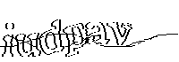
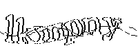
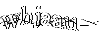
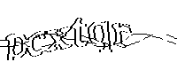
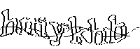

<!-- 本文件由 ./make.md 自动生成，请不要直接修改此文件 -->

# tiny_captcha : rust 轻量级验证码生成器，可以编译成 wasm

[项目文档](https://docs.rs/tiny_captcha)

轻量级验证码生成器，仅依赖于 rand 和 gif ，可以编译成 wasm 。

在 [Ivan Tikhonov 的验证码库](http://brokestream.com/captcha.html) 的基础上，用 [c2rust](https://c2rust.com) 转代码后改写。

字体文件来自 https://github.com/ITikhonov/captcha/blob/master/font.h ，是 ASCII 艺术字 , make 之后用 unfont 生成数组。

使用演示 :

```rust
use anyhow::Result;
use std::{env::current_exe, fs::File};
use tiny_captcha::gif;

fn main() -> Result<()> {
  for i in 1..=10 {
    let exe = current_exe()?;
    let gif_path = exe.parent().unwrap().join(format!("{}.gif", i));

    let word = gif(&mut File::create(&gif_path)?);
    println!("{} {}", word, gif_path.display());
  }
  Ok(())
}
```

输出展示 :

         