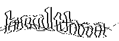
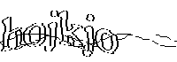

# tiny_captcha

轻量级验证码生成器，仅依赖于 rand 和 gif ，可以编译成 wasm 。

在 [Ivan Tikhonov 的验证码库](http://brokestream.com/captcha.html) 的基础上，用 [c2rust](https://c2rust.com) 转代码后改写。

字体文件来自 https://github.com/ITikhonov/captcha/blob/master/font.h ，是 ASCII 艺术字 , make 之后用 unfont 生成数组。

使用演示 :

```rust
#include ./examples/main.rs
```

输出展示 :

         
